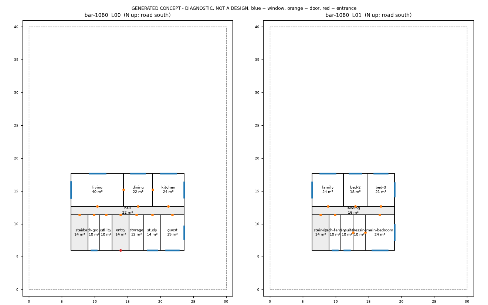
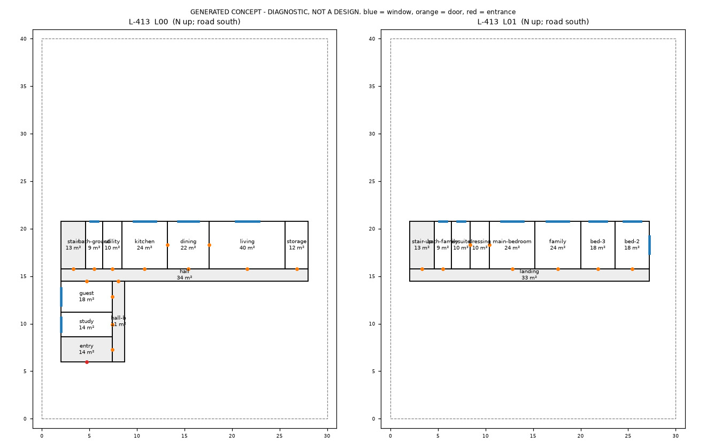
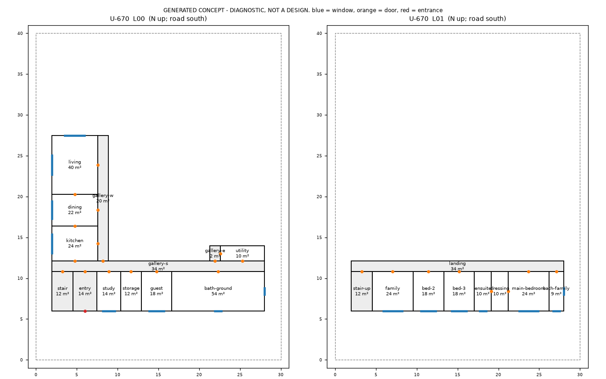

# Pilot concepts: generator v1 (DIAGNOSTIC)

Generated by `python scripts/concept.py generate` on the fictional pilot (`knowledge/projects/villa-pilot.json`: 30 x 40 m plot, road south, garden north, 272 m2 programme, 400 m2 scenario allowance). The real villa (Sheikh Zayed) is untouched.

**Status: diagnostic.** The critic's graph checks are calibrated against published room graphs (tests/test_concept_calibration.py). Its geometric checks are not: no held book gives a labelled, dimensioned house plan to calibrate them against. So these are not concepts to show a client; they show that the search-and-critique chain runs end to end.

Generator settings (not standards): corridor 1.3 m, stair allowance 2.6 m run, minimum room run 1.8 m, building 6 m from the road boundary (setbacks not supplied), storey 3.3 m.

## bar: `bar-1080` (best of 1500 variants)

Spec: `spec/concepts/pilot/bar.yaml` (loads with `archpipe.model.load`).

| Check | Status | Detail |
|---|---|---|
| private_access | pass | `{"rooms": []}` |
| wc_access | pass | `{"rooms": ["bath-ground"]}` |
| reachability | pass | `{"rooms": []}` |
| links_built | pass | `{"links": []}` |
| window | pass | `{"rooms": []}` |
| wet_stack | pass | `{"rooms": [], "note": "pass = at least half of each upper sanitary room lies over a ground wet room (project threshold)"}` |
| living_north | pass | `{"rooms": ["living"]}` |
| within_plot | pass | `{"rooms": [], "note": "Setbacks unknown: not checked."}` |
| gross_area | pass | `{"gross_m2": 348.1, "available_m2": 400, "note": "Gross measured to wall centrelines."}` |
| circulation_area | advisory | `{"achieved_m2": 66.8, "allowance_m2": 40, "excess_m2": 26.8}` |
| elongation | advisory | `{"east_west_m": 17.2, "north_south_m": 11.7, "ratio": 1.47}` |
| area_match | fail | `{"rooms": ["bath-ground"], "deviation_m2": {"bath-ground": 3.7, "utility": -0.0, "entry": 0.0, "storage": -0.1, "study": 0.0, "guest": 1.2, "living": 0.0, "dining": 0.0, "kitchen":` |
| upper_supported | pass | `{"rooms": []}` |
| structure | not_certified | `{"max_room_short_side_m": 5.0}` |
| cooling | not_measured | `{}` |

Rule engine on the emitted spec (legacy rules are diagnostic per the rule audit): VIEW-01 advisory x2

## L: `L-413` (best of 1500 variants)

Spec: `spec/concepts/pilot/L.yaml` (loads with `archpipe.model.load`).

| Check | Status | Detail |
|---|---|---|
| private_access | pass | `{"rooms": []}` |
| wc_access | pass | `{"rooms": ["bath-ground"]}` |
| reachability | pass | `{"rooms": []}` |
| links_built | pass | `{"links": []}` |
| window | pass | `{"rooms": []}` |
| wet_stack | pass | `{"rooms": [], "note": "pass = at least half of each upper sanitary room lies over a ground wet room (project threshold)"}` |
| living_north | pass | `{"rooms": ["living"]}` |
| within_plot | pass | `{"rooms": [], "note": "Setbacks unknown: not checked."}` |
| gross_area | pass | `{"gross_m2": 379.5, "available_m2": 400, "note": "Gross measured to wall centrelines."}` |
| circulation_area | advisory | `{"achieved_m2": 103.6, "allowance_m2": 40, "excess_m2": 63.6}` |
| elongation | advisory | `{"east_west_m": 26.0, "north_south_m": 14.8, "ratio": 1.76}` |
| area_match | fail | `{"rooms": ["bath-ground"], "deviation_m2": {"bath-ground": 3.0, "utility": 0.0, "kitchen": -0.0, "dining": 0.0, "living": 0.0, "storage": -0.0, "entry": 0.0, "study": 0.0, "guest":` |
| upper_supported | pass | `{"rooms": []}` |
| structure | not_certified | `{"max_room_short_side_m": 5.0}` |
| cooling | not_measured | `{}` |

Rule engine on the emitted spec (legacy rules are diagnostic per the rule audit): LIGHT-01 warning x1; VIEW-01 advisory x2

## U: `U-670` (best of 1500 variants)

Spec: `spec/concepts/pilot/U.yaml` (loads with `archpipe.model.load`).

| Check | Status | Detail |
|---|---|---|
| private_access | pass | `{"rooms": []}` |
| wc_access | pass | `{"rooms": ["bath-ground"]}` |
| reachability | pass | `{"rooms": []}` |
| links_built | pass | `{"links": []}` |
| window | pass | `{"rooms": []}` |
| wet_stack | pass | `{"rooms": [], "note": "pass = at least half of each upper sanitary room lies over a ground wet room (project threshold)"}` |
| living_north | pass | `{"rooms": ["living"]}` |
| within_plot | pass | `{"rooms": [], "note": "Setbacks unknown: not checked."}` |
| gross_area | fail | `{"gross_m2": 436.1, "available_m2": 400, "note": "Gross measured to wall centrelines."}` |
| circulation_area | advisory | `{"achieved_m2": 115.0, "allowance_m2": 40, "excess_m2": 75.0}` |
| elongation | advisory | `{"east_west_m": 26.1, "north_south_m": 21.4, "ratio": 1.21}` |
| area_match | fail | `{"rooms": ["bath-ground"], "deviation_m2": {"entry": -0.1, "study": 0.2, "storage": 0.0, "guest": -0.0, "bath-ground": 48.5, "kitchen": 0.1, "dining": -0.2, "living": 0.0, "utility` |
| upper_supported | pass | `{"rooms": []}` |
| structure | not_certified | `{"max_room_short_side_m": 5.6}` |
| cooling | not_measured | `{}` |

Rule engine on the emitted spec (legacy rules are diagnostic per the rule audit): VIEW-01 advisory x2

## Check bases

- **private_access**: Pilot fact 'privacy': private bedroom access must bypass public entertaining rooms (knowledge/projects/villa-pilot.json); same test as guidance.concept_checks.
- **wc_access**: Pilot fact 'hosting' (weekly guests): a WC on the entrance level reached without entering a private room.
- **reachability**: Every room must be reachable from the entrance.
- **links_built**: The layout must realise the doors its own graph intends.
- **window**: Bedrooms, living rooms, kitchens: SLL Code for Lighting minimum average daylight factors (cards sll-min-adf-bedroom/-living/-kitchen); a room with no window cannot meet them. Study and dining are included by extension (project judgement: rooms occupied by day), not by those cards.
- **wet_stack**: Pilot fact 'adjacencies': wet rooms proposed to stack.
- **living_north**: Pilot fact 'views': the northern garden view is the scenario priority.
- **within_plot**: Pilot fact 'boundary': 30 m east-west by 40 m north-south. Setbacks are not supplied.
- **circulation_area**: Pilot area schedule circulation_m2 allowance (project figure, not a standard); halls, landings and stairs, not the scheduled entry.
- **upper_supported**: Project judgement: an upper room with no ground room under it needs a cantilever or transfer, which is structural (consultant) scope; the concept must not rely on it silently.
- **area_match**: Pilot area schedule: each room within 25 % of its scheduled area (project tolerance, not a standard).
- **gross_area**: Pilot area schedule: available_m2 is a scenario allowance, not a legal envelope.
- **elongation**: Card lechner-east-west-axis (qualitative): prefer a plan elongated east-west.

## Not assessed (consultant scope or not yet run)

- Cooling per concept: run the thermal shoebox per facade (`workstation.py thermal`) before choosing.
- Structure, glare, HVAC, electrical, plumbing: MISSING in-house; consultant hand-off.
